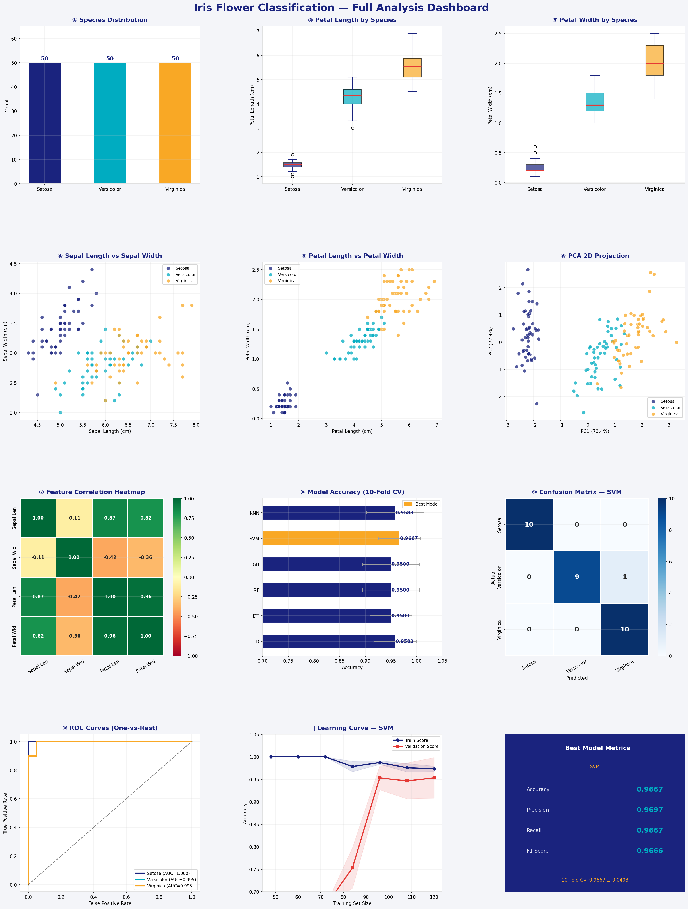

# 🌸 Iris Flower Classification

A machine learning project that classifies Iris flowers into three species — **Setosa**, **Versicolor**, and **Virginica** — based on sepal and petal measurements. Built with Python and Scikit-learn.



---

## 📁 Project Structure

```
iris-flower-classification/
│
├── data/
│   └── IRIS.csv                    # Iris dataset (150 samples, 3 species)
│
├── src/
│   ├── preprocess.py               # Data loading, encoding, train/test split & scaling
│   ├── train.py                    # Model training & cross-validation
│   ├── visualize.py                # 12-panel dashboard generation
│   └── predict.py                  # Predict species for new measurements
│
├── outputs/
│   ├── best_model.pkl              # Saved best model (generated after training)
│   └── iris_dashboard.png          # Analysis dashboard (generated after visualizing)
│
├── requirements.txt
└── README.md
```

---

## ⚙️ Setup

```bash
# 1. Clone the repository
git clone https://github.com/your-username/iris-flower-classification.git
cd iris-flower-classification

# 2. Install dependencies
pip install -r requirements.txt
```

---

## 🚀 Usage

### Step 1 — Train the model
```bash
python src/train.py --data data/IRIS.csv
```

### Step 2 — Generate the analysis dashboard
```bash
python src/visualize.py --data data/IRIS.csv --model outputs/best_model.pkl
```

### Step 3 — Predict a single flower
```bash
python src/predict.py --sl 5.1 --sw 3.5 --pl 1.4 --pw 0.2
```

### Step 4 — Predict from a CSV file
```bash
python src/predict.py --data data/new_flowers.csv --model outputs/best_model.pkl
```

---

## 🤖 Models & Results (10-Fold Cross-Validation)

| Model | CV Accuracy |
|---|---|
| Logistic Regression | 0.9583 ± 0.0417 |
| Decision Tree | 0.9500 ± 0.0408 |
| Random Forest | 0.9500 ± 0.0553 |
| Gradient Boosting | 0.9500 ± 0.0553 |
| **SVM (RBF)** ✅ | **0.9667 ± 0.0408** |
| K-Nearest Neighbors | 0.9583 ± 0.0559 |

**Best model (SVM) — Test set metrics:**
- Accuracy:  0.9667
- Precision: 0.9697
- Recall:    0.9667
- F1 Score:  0.9667

---

## 📊 Dashboard Panels

The 12-panel dashboard includes:

1. Species distribution (perfectly balanced — 50 per class)
2. Petal length boxplot by species
3. Petal width boxplot by species
4. Sepal length vs sepal width scatter
5. Petal length vs petal width scatter
6. PCA 2D projection (visualizing separability)
7. Feature correlation heatmap
8. Model accuracy comparison (CV bar chart)
9. Confusion matrix
10. ROC curves (One-vs-Rest, AUC per class)
11. Learning curve (train vs validation)
12. Best model metrics summary card

---

## 📂 Dataset

**Source:** UCI Machine Learning Repository — Iris Dataset  
**Records:** 150 flowers (50 per species)  
**Features:** `sepal_length`, `sepal_width`, `petal_length`, `petal_width`  
**Target:** `species` (Setosa, Versicolor, Virginica)

---

## 🛠 Tech Stack

- **Python 3.9+**
- **Scikit-learn** — classification models, PCA, metrics
- **Pandas / NumPy** — data processing
- **Matplotlib / Seaborn** — visualization

---

## 💡 Key Insights

- **Setosa** is perfectly linearly separable from the other two species based on petal measurements
- **Petal length** and **petal width** are the most discriminating features (correlation > 0.96)
- **Versicolor** and **Virginica** overlap slightly, making them harder to distinguish
- PCA shows 97%+ variance is captured in just 2 components
- SVM with RBF kernel achieves the best generalization on this dataset

---

## 👤 Author

Built as an introductory ML classification project using the classic Iris dataset.
