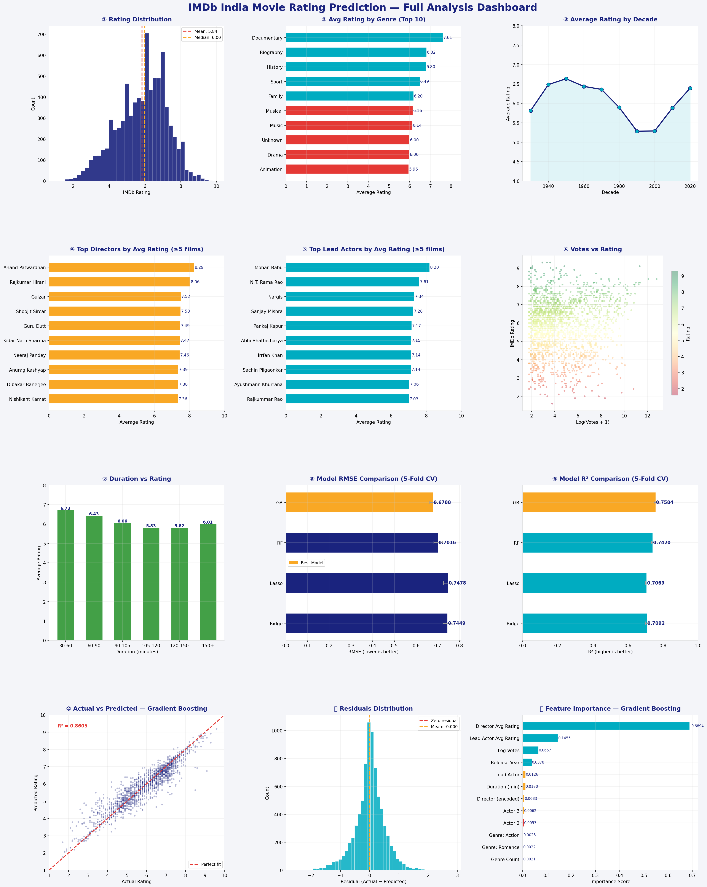

# 🎬 Movie Rating Prediction

A machine learning project that predicts IMDb ratings for Indian movies using regression models. Built with Python and Scikit-learn, featuring comprehensive exploratory data analysis and feature engineering.



---

## 📁 Project Structure

```
movie-rating-prediction/
│
├── data/
│   └── IMDb_Movies_India.csv       # IMDb India movies dataset (15,509 entries)
│
├── src/
│   ├── preprocess.py               # Data cleaning & feature engineering
│   ├── train.py                    # Model training & evaluation
│   ├── visualize.py                # 12-panel dashboard generation
│   └── predict.py                  # Run predictions on new data
│
├── outputs/
│   ├── best_model.pkl              # Saved best model (generated after training)
│   └── movie_rating_dashboard.png  # Analysis dashboard (generated after visualizing)
│
├── requirements.txt
└── README.md
```

---

## ⚙️ Setup

```bash
# 1. Clone the repository
git clone https://github.com/your-username/movie-rating-prediction.git
cd movie-rating-prediction

# 2. Install dependencies
pip install -r requirements.txt
```

---

## 🚀 Usage

### Step 1 — Train the model
```bash
python src/train.py --data data/IMDb_Movies_India.csv
```

### Step 2 — Generate the analysis dashboard
```bash
python src/visualize.py --data data/IMDb_Movies_India.csv --model outputs/best_model.pkl
```

### Step 3 — Predict ratings for new movies
```bash
python src/predict.py --data data/new_movies.csv --model outputs/best_model.pkl
```

---

## 🤖 Models & Results

| Model | CV RMSE | CV R² |
|---|---|---|
| Ridge Regression | 0.7449 ± 0.0216 | 0.7092 |
| Lasso Regression | 0.7478 ± 0.0219 | 0.7069 |
| Random Forest | 0.7016 ± 0.0202 | 0.7420 |
| **Gradient Boosting** ✅ | **0.6788 ± 0.0165** | **0.7584** |

**Best model (Gradient Boosting) — Training metrics:**
- RMSE: 0.5161
- MAE:  0.3694
- R²:   0.8605

---

## 🔧 Feature Engineering

| Feature | Description |
|---|---|
| `Year_clean` | Extracted 4-digit year from "(YYYY)" format |
| `Duration_min` | Runtime in minutes (extracted from "X min") |
| `Votes_log` | Log-transformed vote count to reduce skew |
| `Genre_count` | Number of genres assigned to the movie |
| `genre_*` | One-hot flags for top 12 genres (Drama, Action, Romance, …) |
| `Director_enc` | Label-encoded director (top 50 + Other) |
| `Actor1/2/3_enc` | Label-encoded actor names |
| `Director_avg_rating` | Director's historical average IMDb rating (target encoding) |
| `Actor1_avg_rating` | Lead actor's historical average IMDb rating (target encoding) |

---

## 📊 Dashboard Panels

The 12-panel dashboard includes:

1. Rating distribution with mean/median lines
2. Average rating by genre (top 10)
3. Rating trends by decade
4. Top directors by average rating
5. Top lead actors by average rating
6. Votes vs rating scatter plot
7. Duration bands vs average rating
8. Model RMSE comparison (5-fold CV)
9. Model R² comparison (5-fold CV)
10. Actual vs predicted scatter
11. Residuals distribution
12. Feature importance chart

---

## 📂 Dataset

**Source:** IMDb India Movies Dataset  
**Records:** 15,509 movies | **Usable (with ratings):** 7,919  
**Columns:** `Name`, `Year`, `Duration`, `Genre`, `Rating`, `Votes`, `Director`, `Actor 1`, `Actor 2`, `Actor 3`

---

## 🛠 Tech Stack

- **Python 3.9+**
- **Scikit-learn** — regression models & evaluation
- **Pandas / NumPy** — data processing & feature engineering
- **Matplotlib / Seaborn** — visualization

---

## 💡 Key Insights

- **Votes** is the strongest predictor of rating — more popular films tend to rate higher
- **Director & Actor historical averages** (target encoding) are highly predictive
- **Biography, Documentary, and History** genres tend to have above-average ratings
- Longer films (120–150 min) tend to receive slightly higher ratings
- Movie ratings have remained relatively stable across decades (avg ~5.8–6.5)

---

## 👤 Author

Built as a beginner-to-intermediate ML project exploring regression techniques on real-world IMDb data.
