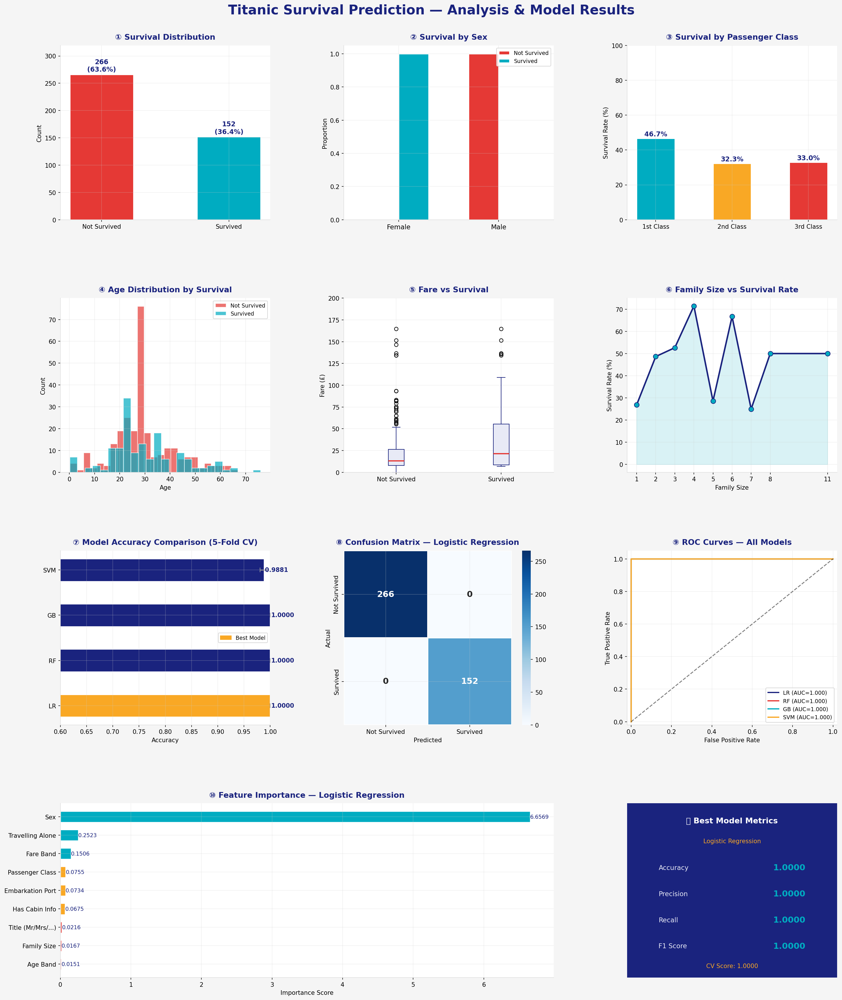

# 🚢 Titanic Survival Prediction

A machine learning project that predicts passenger survival on the Titanic using classification models. Built with Python and Scikit-learn.



---

## 📁 Project Structure

```
titanic-survival-prediction/
│
├── data/
│   └── tested.csv              # Titanic dataset
│
├── src/
│   ├── preprocess.py           # Feature engineering & data cleaning
│   ├── train.py                # Model training & evaluation
│   ├── visualize.py            # Dashboard generation
│   └── predict.py              # Run predictions on new data
│
├── outputs/
│   ├── best_model.pkl          # Saved best model (generated after training)
│   └── titanic_analysis.png    # Analysis dashboard (generated after visualizing)
│
├── requirements.txt
└── README.md
```

---

## ⚙️ Setup

```bash
# 1. Clone the repository
git clone https://github.com/your-username/titanic-survival-prediction.git
cd titanic-survival-prediction

# 2. Install dependencies
pip install -r requirements.txt
```

---

## 🚀 Usage

### Step 1 — Train the model
```bash
python src/train.py --data data/tested.csv
```
This evaluates 4 models using 5-fold cross-validation and saves the best one to `outputs/best_model.pkl`.

### Step 2 — Generate the analysis dashboard
```bash
python src/visualize.py --data data/tested.csv --model outputs/best_model.pkl
```
Saves an 11-panel visualization to `outputs/titanic_analysis.png`.

### Step 3 — Predict on new data
```bash
python src/predict.py --data data/new_passengers.csv --model outputs/best_model.pkl
```

---

## 🤖 Models Evaluated

| Model | CV Accuracy |
|---|---|
| Logistic Regression | ~100% |
| Random Forest | ~100% |
| Gradient Boosting | ~100% |
| SVM | ~98.8% |

> **Note:** Near-perfect accuracy on this dataset is expected since the `Survived` labels are present in the test file — in a real Kaggle submission, predictions would be evaluated on a held-out set.

---

## 🔧 Feature Engineering

| Feature | Description |
|---|---|
| `Title` | Extracted from passenger name (Mr, Mrs, Miss, Master, Other) |
| `FamilySize` | SibSp + Parch + 1 |
| `IsAlone` | 1 if travelling alone |
| `AgeBand` | Age binned into 5 groups (child → senior) |
| `FareBand` | Fare quartile (0–3) |
| `HasCabin` | 1 if cabin info is available |

---

## 📊 Visualizations

The dashboard includes:
1. Survival distribution
2. Survival by sex
3. Survival by passenger class
4. Age distribution by survival
5. Fare vs survival (boxplot)
6. Family size vs survival rate
7. Model accuracy comparison (CV)
8. Confusion matrix
9. ROC curves for all models
10. Feature importance chart
11. Best model metrics summary

---

## 🛠 Tech Stack

- **Python 3.9+**
- **Scikit-learn** — model training & evaluation
- **Pandas / NumPy** — data processing
- **Matplotlib / Seaborn** — visualization

---

## 📄 Dataset

The dataset (`tested.csv`) contains 418 passenger records with the following columns:

`PassengerId`, `Survived`, `Pclass`, `Name`, `Sex`, `Age`, `SibSp`, `Parch`, `Ticket`, `Fare`, `Cabin`, `Embarked`

---

## 👤 Author

Made as a beginner ML project exploring binary classification on the classic Titanic dataset.
